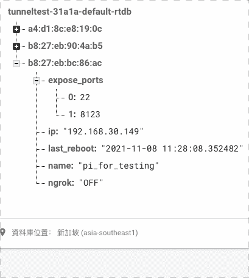

# Ngrok Controller (by using Firebase)

----

## Introduction:
This is a program for turning ngrok on/off manually by using firebase realtime database (rtdb).

By setting a key value in rtdb to "ON" to create a ngrok tunnel session, and "OFF" to turn off, so the service can control it's port 22 expose or not.

Free lience of ngrok can only turn on ONE tunnel in a time.

---

## Environment:
* Successfully run on raspberry pi3 with official os.
* python 3.9
----

## Description:
This program is design for one or many online service, that may sometimes need remote access.
It use the free service of ngrok, so user do not need to config any network equipment, and still can make device's port 22 remotely.

**Free lience of ngrok can only turn on ONE tunnel in a time.**



As you may see that ngrok_url appears, user can ssh to the device by providing url.

----

## What you need to prepare:
1. Ngrok token
   * 從官網註冊，取得 [token](https://dashboard.ngrok.com/get-started/your-authtoken )。
2. Firebase private key file ()
   * 可參考[教學文](https://firebase.google.com/docs/admin/setup )，下載完後是一個．json，請將檔名改為'serviceAccountKey.json'並置於專案根目錄。
3. firebase rtdb url
   * 登錄firebase，建立專案後，建立realtime database，將會獲得資料庫的url。
   * 
4. .env
   1. create a file name .env
   2. add parameters in file:
   ```
    DEVICE_NAME = <YorDeviceName> (optional)
    NGROK_TOKEN = <Your Ngrok token>
    DATABASE_URL = <Your firebase rtdb url>
    ```
   
----

# How to use:
If you have all file satisfy and python requirements install successfully, the service may turn on as long as the main.py is running. (of course the device must be online.)

I'm using this code as a system daemon that will automatically run while raspberry boot up.

Here is a reference of how i write my systemd:
```buildoutcfg
[Unit]
Description=Contrling ngrok tunnel by firebase
Wants=network-online.target
After=network-online.target


[Service]
Type=simple
User=pi
Restart=on-failure
StartLimitIntervalSec=10
ExecStart=/usr/bin/python3 /home/pi/Documents/projects/ngrok_test/main.py

[Install]
WantedBy=multi-user.target
```
If you are not sure how to use system daemon in pi, please check [this](https://www.thedigitalpictureframe.com/ultimate-guide-systemd-autostart-scripts-raspberry-pi/ ).

----


